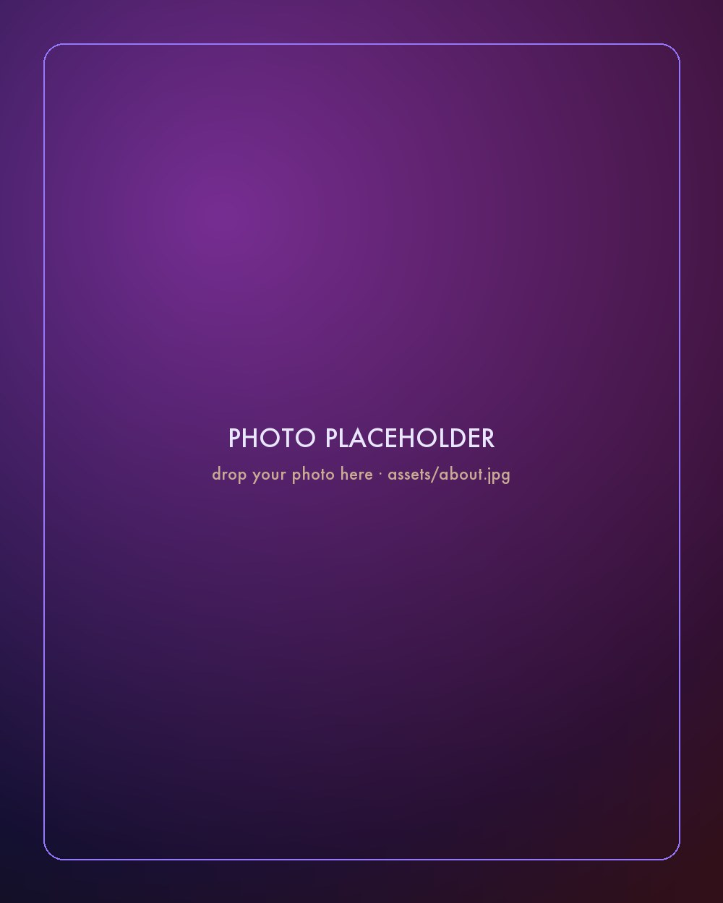

# Updating your portfolio

Everything lives in two places:
- `index.html` — the page itself. Search it for `EDIT:` to jump to every editable spot.
- `assets/` — your files: `resume.pdf`, `about.jpg`.

After any change: save, then (if deployed) `git add -A && git commit -m "update" && git push`. GitHub Pages rebuilds in ~30–60s.

---

## 1. Swap the photo
Your real photo just **replaces the placeholder file** — no HTML editing needed.
1. Name your photo `about.jpg`.
2. Drop it into `assets/`, overwriting the placeholder.
   - Best results: a portrait crop, roughly 4:5 (e.g. 1000×1250). It's shown in the About section.
3. Refresh. Done.

If you'd rather keep a different filename, change the one line in `index.html`:
```html
<!-- EDIT: drop your photo at assets/about.jpg -->

```

> Want a headshot in the hero too? Tell me and I'll add a hero image slot — right now the hero is intentionally type-only (cleaner, more editorial).

## 2. Swap the résumé
1. Export your new résumé as a PDF named `resume.pdf`.
2. Drop it into `assets/`, overwriting the old one.
3. Done — every "Résumé" / "Download résumé" link already points there.

**Multiple résumé tracks (best practice):** host only the canonical one here as `resume.pdf` (currently your Model Risk version). Keep other tracks (e.g. AI-Engineering) as separate files you send directly to applications — don't publish a menu of them.

## 3. Make a "Coming soon" demo go live
Each non-live demo currently shows a `Coming soon` badge and a dead `Demo ↗`. To activate one, find its `<article class="card">` block and swap the footer:

```html
<!-- BEFORE -->
<div class="card-foot"><span class="badge-soon">Coming soon</span><a class="card-link muted">Demo ↗</a></div>

<!-- AFTER -->
<div class="card-foot">
  <span class="badge-live"><span class="d"></span>Live</span>
  <a class="card-link" href="https://YOUR-DEMO-URL" target="_blank" rel="noopener">Open demo <span class="arw">↗</span></a>
</div>
```
The demo opens in a **new tab**, so your portfolio stays open underneath (the return path you chose — no in-app back button needed).

## 4. Add a new demo card
Copy any existing `<article class="card">…</article>` block, paste it inside the right domain's `<div class="cards">`, and edit the title, description, and `chip`s. Capability chips use `class="chip cap"` (purple); plain tags use `class="chip"`.

## 5. Add a Loom walkthrough
In the **Walkthroughs** section, replace a placeholder `.video-thumb` with the embed:
```html
<div class="video-card">
  <div class="video-thumb" style="padding:0">
    <iframe src="https://www.loom.com/embed/YOUR_LOOM_ID"
      style="width:100%;height:100%;border:none" allowfullscreen loading="lazy"></iframe>
  </div>
  <div class="video-body">
    <div class="video-title">Claims Guard — full walkthrough</div>
    <div class="video-meta">Loom · 8 min</div>
  </div>
</div>
```

## 6. Turn on the contact form
The form needs a free Formspree backend:
1. [formspree.io](https://formspree.io) → free account → New Form → copy the form ID (e.g. `xpzgkqra`).
2. In `index.html` find `action="https://formspree.io/f/YOUR_FORM_ID"` and replace `YOUR_FORM_ID`.

Submissions then arrive in your Gmail. (The `mailto:` link and LinkedIn already work as-is.)

## 7. Day/night theme
The site ships with a sun/moon toggle in the nav — **night is the default**, day is
the amber-led "sunset paper" flip of the same palette. The visitor's choice persists
(localStorage). All day-mode colors live in one `[data-theme="day"]{…}` block near
the top of `index.html` — tweak tokens there only; never hardcode day colors inline.
The shared `../brand-kit/theme.css` has the same block, so any demo using the kit
is day-ready too (set `data-theme="day"` on `<html>`).

## 8. Edit text (bio, name, links)
Search `index.html` for `EDIT:` — every one marks a spot: hero bio, LinkedIn URL, email, résumé path.

---

## Deploying (GitHub Pages — free, no cold starts)
One-time:
```bash
cd "/Users/poulaghosh/Lami's demo apps/portfolio"
git init && git checkout -b main
git add -A && git commit -m "feat: portfolio"
# create a PUBLIC repo named  poulami-ghosh.github.io  on github.com, then:
git remote add origin https://github.com/YOUR_USERNAME/poulami-ghosh.github.io.git
git push -u origin main
```
Then repo → Settings → Pages → Source: `main` / `/(root)` → Save. Live at `https://YOUR_USERNAME.github.io` in ~60s.

Every later update: `git add -A && git commit -m "..." && git push`.
